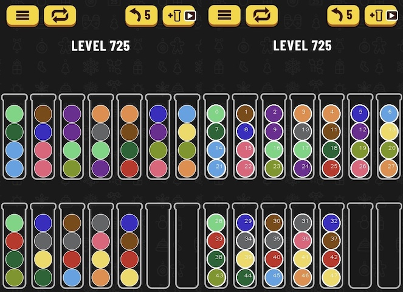
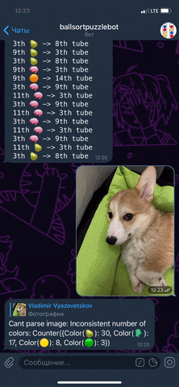

# Ball Sort Puzzle

   
   

Telegram bot, that solves Ball Sort Puzzle mobile game. Written in Python, hosted by serverless Yandex.Function.

You can find a profound description about how it works [here](https://habr.com/ru/post/536086/) [Russian].

**Usage**
---

* Add the Telegram Bot [@ballsortpuzzlebot](https://t.me/ballsortpuzzlebot) to list of your contacts.
* Send him a screenshot of the Ball Sort Puzzle game.
* You will receive a solution. That's all!

**How to Contribute**
---

1. Clone the repo and create a new branch:
    + `$ git checkout https://github.com/ErhoSen/ball-sort-puzzle -b name_for_new_branch`.

1. Install all dependencies with [`Poetry`](https://python-poetry.org/)
    + `$ poetry install`

1. Make sure that project is ready for development by running tests
    + `$ make test`

1. Make changes and test

1. Don't forget to format your code, by running
    + `$ make format`
    + or you can install [`pre-commit`](https://pre-commit.com/), that will do it for you

1. Submit Pull Request with comprehensive description of changes

**Links**
---

* Join [Ball Sort Puzzle](https://t.me/joinchat/ESxZzRnHXdPzr5XVAV6UfQ) community in Telegram [International]
